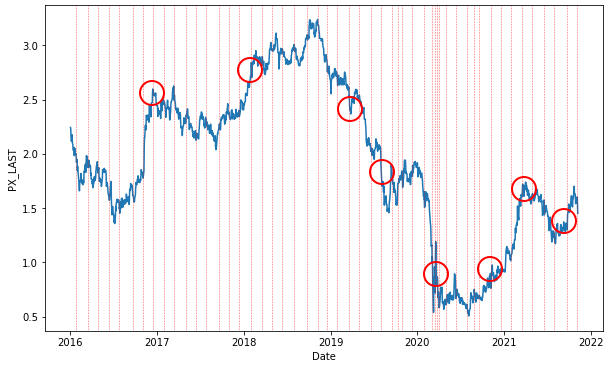
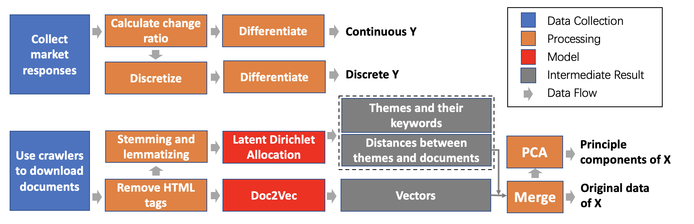
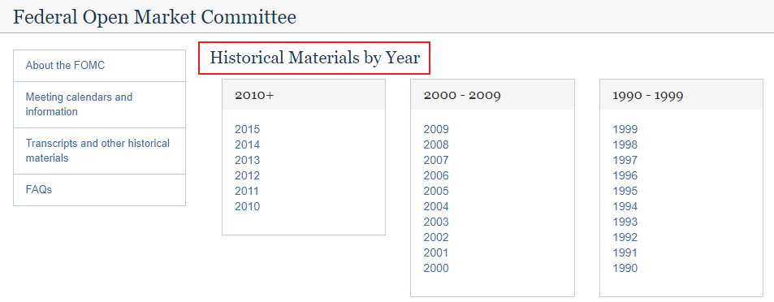
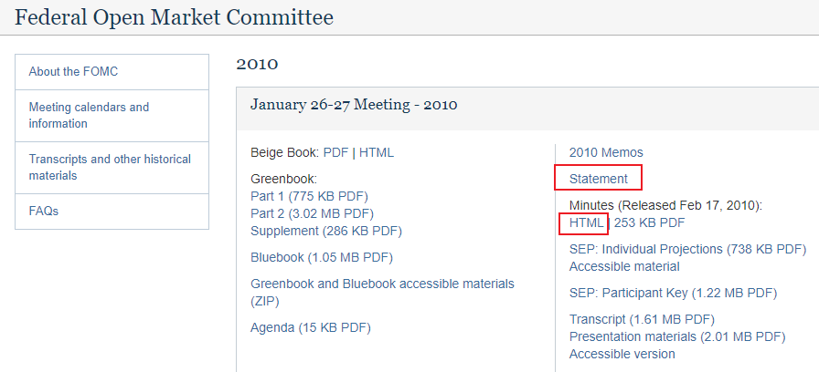
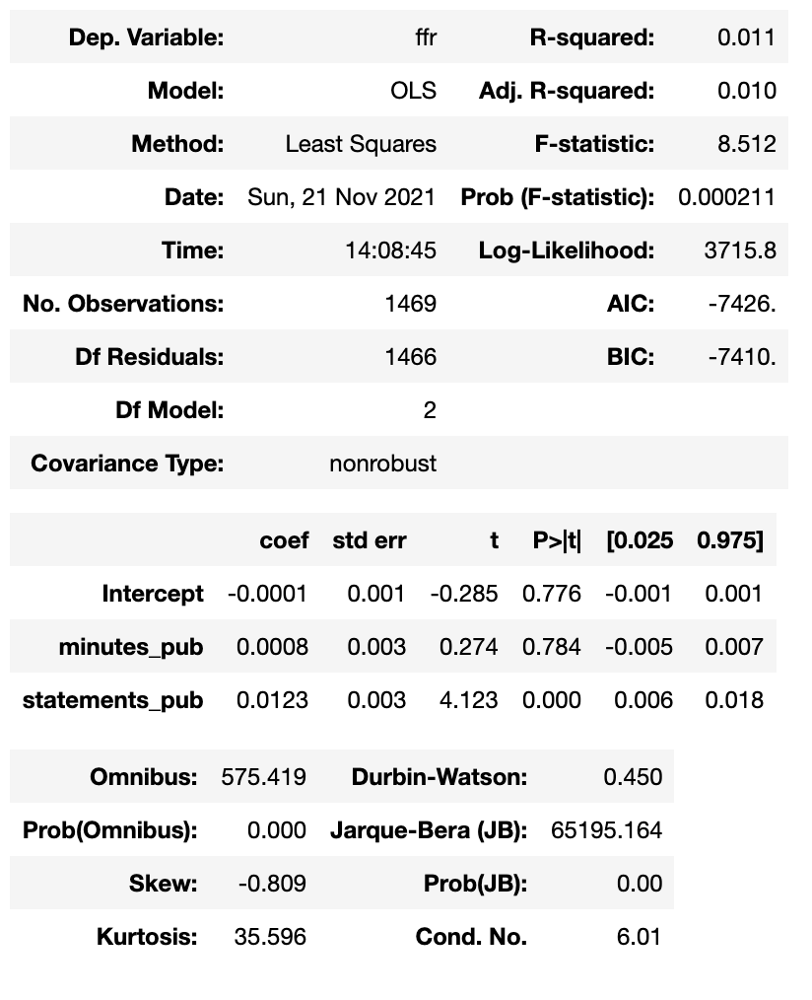

# Sentiment Analysis on FOMC Statements and Minutes

This is a group project of [PHBS_MLF_2021](https://github.com/PHBS/MLF) course at Peking University HSBC Business School. 

**Team:** [ZHAI Sihan](https://github.com/zhai1997) & [HU Xueyang](https://github.com/XueyangHu) 

**Instructor:** [Jaehyuk Choi](https://github.com/jaehyukchoi) 

**Files:** [Sentiment Analysis.ipynb](https://github.com/XueyangHu/PHBS_MLF_2021/blob/master/Project/Sentiment%20Analysis.ipynb) (Chapter1, Chapter 3-7), [Web Crawler.ipynb](https://github.com/XueyangHu/PHBS_MLF_2021/blob/master/Project/Web%20Crawler.ipynb) (Chapter 2), [Cosine Similarity.ipynb](https://github.com/XueyangHu/PHBS_MLF_2021/blob/master/Project/Cosine%20Similarity.ipynb) (Chapter 7.1), [PDF Processor.ipynb](https://github.com/XueyangHu/PHBS_MLF_2021/blob/master/Project/PDF%20Processor.ipynb) (Appendix)

## 1. Introduction

* **Motivation:** In Figure 1, red dash lines mark the date when FOMC statements were released. The blue line is the return of 10-year treasury bond. We can find that the publication of FOMC statements has a clear impact on the financial market, and red circles give some examples. We wonder how the information in FOMC statements influences the financial market, and whether we can use the information to predict the future of the market and thus make money.

 <strong>Figure 1:</strong> Influence of publication of statements on 10-year treasury bond yield

* **X:** After we develop crawlers to download documents from FOMC's website (Chapter 2), we extract information from the documents with both Doc2Vec (Chapter 3) and Latent Dirichlet Allocation (LDA, Chapter 4). Then we calculate the difference between two consecutive statements (Chapter 5.1) and principal components of the difference (Chapter 5.2), both of which are used for our prediction models.
* **Y:** We download Federal Funds Rate, short-term and long-term treasury bond yields from Bloomberg (Chapter 5.3). Then we construct Y variables in two ways, i.e. discrete variables and continuous variables (Chapter 5.4).
* **Influence of Statements:** We first plot the influence of the publication of statements on Y (Chapter 6.1). 
    1. Discrete Y: For discrete Y, we use Random Forest (Chapter 6.2 for original vectors and Chapter 6.3 for principal components), Support Vector Machine (SVM, Chapter 6.4 for original vectors and Chapter 6.5 for principal components) and Dense Neural Network (Chapter 6.6) to do prediction. We also adopt Grid Search to look for appropriate hyper-parameters, and test the accuracy of our models with 5-fold method.
    2. Continuous Y: For continuous Y, we use Dense Neural Network to do prediction (Chapter 6.7).
* **Explore Minutes:**
    1. Cosine similarity: We calculate the cosine similarity between the statement and minutes of the same meeting, and the similarity between two consecutive minutes (Chapter 7.1).
    2. Influence of the publication of minutes: We test the effect of the publication of minutes on the responses of financial market (Chapter 7.2 & 7.3).
* **Findings:** 
    1. Discrete Y: Random Forest works the best when predicting all kind of response variables, with the highest accuracy and lowest standard deviation. The accuracy is 40.22% (with std 7.58%) for federal funds rate, 50.03% (with std 5.03%) for 10-year bond, and 51.03% (with std 3.32%) for 3-year bond. Models of principal components cannot beat those of original vectors.
    2. Continuous Y: Dense Neural Network model works significantly better for bond yields (especially for the 10-year treasury bond yield) than for federal funds rate.
    3. Similarity between documents: The cosine similarity based on Doc2Vec model outputs is low and volatile, while the similarity based on LDA model outputs is higher and smoother. Similarity between two consecutive minutes is much higher than that between two statements or between the statement and minutes of the same meeting, meaning that the minutes documents contain less incremental information.
    4. Influence of minutes: The influence of minutes on financial markets is not statistically significant.

## 2. Empirical Work

The empirical work can be divided into two parts.

* **Information extraction:** We use crawlers to collect statements and minutes from FOMC's website and use Natural Language Processing (NLP) models to extract information from those documents. Finally we get **Xs and Ys** as inputs of the prediction models and explore the influence of statements and minutes on the financial market. The procedure of this part is shown in Figure 2.

 

 <strong>Figure 2:</strong> Information Extraction 

* **Influence on the financial market:** In this part, we try several different models and different inputs to study the influence of statements on the financial market. We use Random Forest, SVM and Neural Network as our prediction model, Continues Y and Discrete Y as the response variables, Principal components of X and Original vectors of X as the predictors. We use Grid Search to seek optimal hyper-parameters and 5-fold method to test the accuracy.

Below, we list the explanation of several critical procedures in each part.

#### 2.1 Collect HTML files of FOMC statements and minutes through web crawling

(See [Web Crawler.ipynb](https://github.com/XueyangHu/PHBS_MLF_2021/blob/master/Project/Web%20Crawler.ipynb))

According to FOMC's website,

> The FOMC first announced the outcome of a meeting in February 1994. After making several further post-meeting statements in 1994, the Committee formally announced in February 1995 that all changes in the stance of monetary policy would be immediately communicated to the public. In January 2000, the Committee announced that it would issue a statement following each regularly scheduled meeting, regardless of whether there had been a change in monetary policy.

Therefore, our sample covers the time period from 1994 to 2021. FOMC statements and minutes from 2016 to 2021 can be accessed via [FOMC Meeting calendars, statements, and minutes (2016-2021)](https://www.federalreserve.gov/monetarypolicy/fomccalendars.htm). 

 <strong>Figure 3:</strong> FOMC statements and minutes from 2016 to 2021 

Those materials before 2016 can be accessed via [FOMC Historical Materials by Year](https://www.federalreserve.gov/monetarypolicy/fomc_historical_year.htm).

 <strong>Figure 4:</strong> FOMC statements and minutes before 2016 

Taking the year of 2010 as an example, layout of the website is similar to that of 2016-2021.

 <strong>Figure 5:</strong> Layout of the website 

First, we collect all the links available on the website of each historical year. Second, we define regular expressions for statements and minutes according to the format of the file links. Third, we use the regular expressions defined to match the target links. Finally, we download the statements and minutes through these target links and rename them with the meeting dates.

In practice, formats of the links vary much from year to year, so we download the file manually if it reports an http error.

#### 2.2 Remove HTML tags and convert pdf files

(See [Sentiment Analysis.ipynb](https://github.com/XueyangHu/PHBS_MLF_2021/blob/master/Project/Sentiment%20Analysis.ipynb))

We use packages `BeautifulSoup` and `unicodedata` to clean the tags and markdowns in the html files.

(We also collected a limited number of pdf files for some years before the class presentation. We use the package `pdfminer` to convert the pdf files into txt files and then construct training and test document sets. This procedure is in [PDF Processor.ipynb](https://github.com/XueyangHu/PHBS_MLF_2021/blob/master/Project/PDF%20Processor.ipynb).)

#### 2.3 Stemming and lemmatization

We first remove all the digits and some meaningless words from the documents.  Then, we use package `nltk` to detect the part of speech and stem and lemmatize words based on their part of speech.

#### 2.4 Construct document vectors using Doc2Vec and LDA model in `Gensim` package
* We adopt the Distributed Memory Model of Paragraph Vectors (PV-DM) introduced by Le and Mikolov (2014), with the vector size equal to 20 and the length of window defined as 5.

* We also train the Latent Dirichlet Allocation model introduced by Blei et al. (2003) with 7 topics. Then output of the model is the keywords (center) of each topic and the distance between each document and each topic.  We use the distance calculated by the model as the input of our classification and regression models.

#### 2.5 Random Forest and SVM

We split the training and test samples, and use `sklearn` to build Random Forest and SVM models. We use `sklearn` to do grid search to look for optimal hyper-parameters and test the accuracy of models with 5-fold method. We consider two naive models as benchmarks: 

* Randomly choose one
* Always predict that the price will not change

Our models beat these two models in terms of accuracy.

#### 2.6 Neural Network 

We construct Dense Neural Network models using `keras` package. 

* For discrete y variables, we construct a 3-layer neural network model. The number of nodes in each layer is 32, 16, 3; activation functions in the first two layers are both relu, and the activation function in the third layer is softmax. All weights are initialized as one.

* For continuous y variables, we construct a 4-layer neural network model. The number of nodes in each layer is 16, 8, 4, 1, and activation functions in the first three layers are all relu. The weights are initialized by drawing random numbers from normal distribution.

#### 2.7 Calculate the cosine similarity between documents and influence of minutes 

(See [Cosine Similarity.ipynb](https://github.com/XueyangHu/PHBS_MLF_2021/blob/master/Project/Cosine%20Similarity.ipynb))

We calculate the cosine similarity between documents using both Doc2Vec model outputs and LDA model outputs.

We first calculate the cosine similarity between the statement and minutes of the same meeting, and then the similarity between 2 consecutive documents of the same category.

We also use statistical method to test the influence of minutes on the financial market.

## 3. Empirical Results

#### 3.1 Discrete Y

The result of our prediction model for discrete Y is as below. We can find that

* Random Forest works the best when predicting all kind of response variables, with higher accuracy and lower standard deviation.
* Neural Network works the best for 10-Year Bond Yield.
* Models using principal components cannot beat those using original vectors.

 <strong>Table 1:</strong>  Results using discrete Y

| Model              | X                       | Y                      | Mean Accuracy   | Standard Deviation | Coefficient of Variation |
| :----------------- | ----------------------- | ---------------------- | ------------- | ------------------ | ------------------------ |
| **Random  Forest** | **Original**            | **Federal Funds Rate** | **40.22%** | **7.58%**          | **18.84%**               |
| **Random  Forest** | **Original**            | **10-Year Bond**       | **50.03%** | **5.03%**          | **10.05%**               |
| **Random  Forest** | **Original**            | **3-Year Bond**        | **51.05%** | **3.32%**          | **6.50%**                |
| **Random  Forest** | **Principal Components** | Federal Funds Rate     | 34.99%     | 7.35%              | 21.00%                   |
| **Random  Forest** | **Principal Components** | 10-Year Bond           | 43.82%     | 5.40%              | 12.32%                   |
| **Random  Forest** | **Principal Components** | 3-Year Bond            | 51.57%     | 4.78%              | 9.26%                    |
| **SVM**            | **Original**            | Federal Funds Rate     | 34.53%     | 9.25%              | 26.77%                   |
| **SVM**            | **Original**            | 10-Year Bond           | 45.92%     | 7.48%              | 16.29%                   |
| **SVM**            | **Original**            | 3-Year Bond            | 45.38%     | 6.96%              | 15.33%                   |
| **SVM**            | **Principal Components** | Federal Funds Rate     | 36.53%     | 6.53%              | 17.86%                   |
| **SVM**            | **Principal Components** | 10-Year Bond           | 26.19%     | 16.92%             | 64.59%                   |
| **SVM**            | **Principle Components** | 3-Year Bond            | 42.27%     | 5.26%              | 12.43%                   |
| **Neural Network**            | **Original**       | Federal Funds Rate | 28.62%    | 3.55%          | 12.40%                |
| **Neural Network**            | **Original**       | **10-Year Bond**           | **43.45%**        | **1.50%**              | **3.46%**                   |
| **Neural Network**            | **Original**    | 3-Year Bond            | 37.07%        | 2.81%        | 7.57%  |

#### 3.2 Continuous Y
The result of our prediction model for continuous Y is as follows.

The neural network model identifies changes in 10-year treasury bond yield best and changes in 3-year treasury bond yield second best. However, this model cannot predict the amplitude of abrupt changes well.

 <strong>Table 2:</strong>  Results using continuous Y

| Model              | X                       | Y                      | Mean Squared Error | Standard Deviation of MSE |
| :----------------- | ----------------------- | ---------------------- | ------------- | ------------------ |
| **Neural Network**            | **Original**       | Federal Funds Rate | 5.24E-3   | 1.86E-2         |
| **Neural Network**            | **Original**       | **10-Year Bond**           | **0.58E-3**    | **0.20E-2**   |
| **Neural Network**            | **Original**       | **3-Year Bond**            | **1.67E-3**    | **0.34E-2**   |

#### 3.3 Similarity between documents

We find that the similarity calculated using Doc2Vec model outputs is low and volatile, with its mean close to 0 (ranging from -0.1 to 0.1). The similarity calculated using LDA model outputs is smoother and higher, with its mean around 0.9.

Similarity between 2 consecutive minutes is higher and smoother than that between 2 statements or between the statement and minutes of the same meeting, with the mean of LDA vector similarity equal to 0.99. This high similarity means that the incremental information in minutes is less than that in the statements.

#### 3.4 Influence of minutes

 <strong>Table 3:</strong> Influence of statements VS minutes

We can find from Table 3 that the effect of the publication of minutes is much weaker than that of statements, and is not significant.

## 4. References

[1] Blei, D. M., Ng, A. Y., & Jordan, M. I. (2003). Latent Dirichlet Allocation. *the Journal of Machine Learning Research*, *3*, 993-1022.

[2] Le, Q., & Mikolov, T. (2014). Distributed Representations of Sentences and Documents. *Proceedings of the 31st International Conference on Machine Learning*, *14*, 1188-1196.

